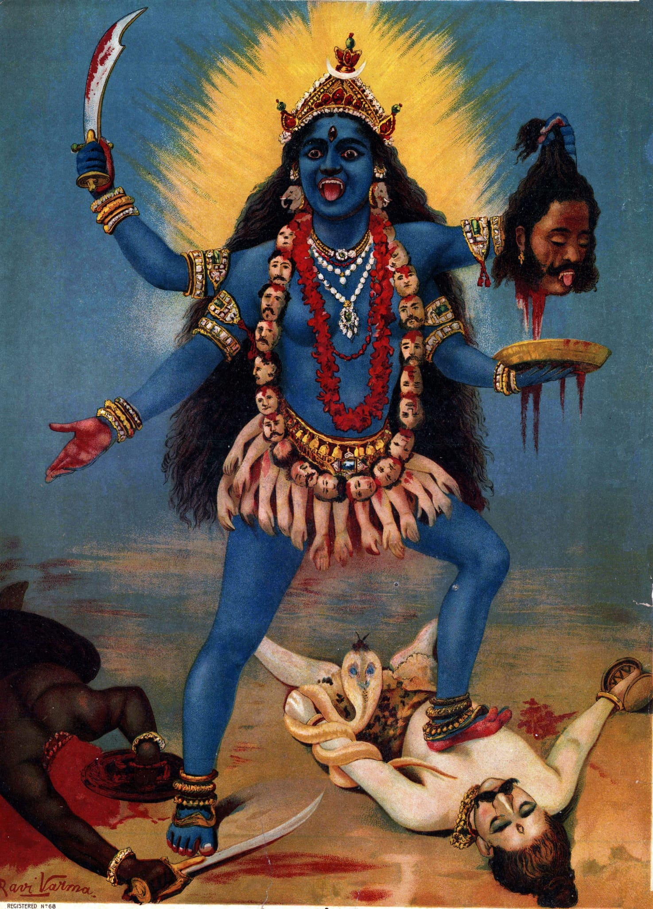

>[Home](../README.md)
# At the park

The sun has been toying with the idea of closing its business for the day.
Having fried the city the whole day, it's now stretching its legs in preparation and has relaxed a bit.

At this time of the day, usually Dassamia park is full of people.

When we say people, it's mostly couples strewn all around the park.
One would be amazed to see how innovative the positions are that these couples find to sit in the park.
Hands and legs intertwined, making it hard to see where one ends and the other begins.
The one objective seems to be that no air should pass between the couple.
All of the couples seem to be be intent on this idea.

The keener of the eye would see that there is one couple sitting in the park that seems to be violating this rule.
They've sat so far apart that it is a borderline case to say that they've sat together.
If fact, if one of them turned their faces away, you may think that they are not together at all.

A local that's conversant with the skills of the auto rickshaw drivers in that place would think it a matter of course for one to swerve the auto through the gap.
And if Dassamia park keepers were any less fearsome or vigilant, we'd have in fact seen at least some of them going between them by now.

As we said the sun has relaxed, and the wind began working its magic.
One would say the odours hitting the nostrils are divine, provided they are willing to discount that one of them has bovine origins, as a fresh dump of cow dung is also making its presence felt along with all the others smells permeating the place.

If fact, those that are keen accumulators of the knowledge about the bovine excreta would say that it was delivered not so long ago.
It still retained the sweetness that's characteristic of the dump that's fresh and not yet been caked by the careless park walkers.

That is to say that it's as pleasant as it could be in mid May evening in Dyrabad.

But anybody looking at Takkarram Kirrakke and Andagamma Adaragottu sitting so far apart would know that they are both impervious to these pleasant surroundings.

It's not just the author and the reader that are keenly aware of this couple.
There's one little blighter who has been following them even more closely than us.

The locals call him Chikka.
It's hard to say how old he is.
Certainly below 15.
Is he above 10? It's hard to know.
It's also very difficult to know where he comes from, where he lives, whether he has any family.

All we know is that he has a shrewd business sense that'll make Babbani, the local billionaire business magnet, proud, if he possessed that knowledge at that tender age.

He is carrying a little basket that has various kinds of dry snacks, the chief among them being [spicy peanuts](../assets/Peanut_Seller_(212582589).jpeg).

If Takkarram were in any normal situation, he would have seen that Chikka has been hiding behind the little grass mound that's freshly developed on his right side.

The reader might be wondering where this grass mound has come from.
It's come from the barren patch in front of Takkarram.
Lest the reader attributes the barren patch to the carelessness of the aforementioned park keepers, who are, in addition to being fearsome, are excellent keepers of the grass in Dassamia park. If they had any inkling that this patch was freshly created in the such a short span of time they would descend upon the culprits with their legendary ferocity.

The patch wasn't there when Takkarram and Andagamma arrived a few minutes earlier.
It's formed because Takkarram has been picking one strand at a time from that spot and putting it on his right side.
He has been doing this since he arrived.

The rate of destruction would make the destroyers of the Brazilian Amazon forest proud. 

The reason for this grass-picking is that Andagamma has been annoyed at him.
She has been giving him fearsome looks, one would say the park keepers, if they got wind of it, would come to take notes in the hope of improving their already considerable expertise in this area.

When Andagamma is in this formidable mood and giving him looks, she reminds Takkarram of the extraordinarily fearsome goddess whose [poster](../assets/Kali_by_Raja_Ravi_Varma.jpeg) Takkarram has grown up seeing everyday. It is one of the most frightful things a little boy can chance upon to see and it leaves an indelible mark on the memory. It depicts an intimidating female warrior with large red eyes, open mouth with the tongue hanging out, a large necklace made of severed heads and hands, bearing not two, as that would not do justice, four hands. One hand carrying a severed head, presumably to add it to the collection, the other carrying a plate to collect the blood flowing from the severed head, can't see why though. The third one has a bloodied sword, and the fourth one luckily is free, one wonders why the creator has not gone full monty, and handed it another object from the same class as others.

God knows how this goddess looks in real life, if indeed it's possible for them to be present in real life, but the portrayal of this particular deity by the poster makers is literally breathtaking.
It would be really interesting to see the reaction of this goddess if she were to descend down to earth and see her fantastical portrayals.
Unfortunately that may not be possible any time soon.

It makes one wonder, what would be the inspiration for these poster makers? What makes their imagination so fertile?

One, who is not partial to these poster makers could imagine that these children of this exotic art form must be male.
This must be their way of letting out something that's happening in their lives without actually saying it directly.

However, we are digressing.

In the meantime, Takkarram having settled his blood flow with the grass picking exercise, picked up courage to utter a word.

He said 'Anda'.

He heard 'Huu', which was not really what Andagamma said. It was just Andagamma's way of acknowledging and not acknowledging at the same time what she has heard. This was the sound produced from her letting out a jet of air through her nostrils. If we have not seen it, we'd not believe those fine delicate nostrils could take this force of air and still remain so fine and delicate.

The courage that Takkarram mustered, evaporated.

He picked some more grass and tried again.

'Anda'.

'Huu'.

More grass.

'Anda'.

'Huu'.

'Anda'.

The last 'Anda' did not come from Takkarram because he has not picked up more grass yet. 
So he came out of his present state in a jerk.
He looked around to see where the last 'Anda' emanated from.
It seemed to be from beyond the grass mound on his right.
He wondered where it came from, as he was not aware of his own phenomenal creation.
He dispersed the grass curious to see the source.
There looking at him intently, he found Chikka.

'Who are you? Why did you say "Anda"'? asked Takkarram impatiently.

'Sir, I wanted to help you'.

'Whaaat !!??... What do you mean help, what help?'. One could sense a bit of irriation in his voice. Here he was trying to woo his beloved - one would imagine, as in the present case, it looks quite untenable proposition -  and this little blot on the landscape coming in his way putting spanner in the works.

'Sir, I noticed you were having trouble calling mam. I've been watching you for a while and guessed that you were going to pick up more grass before calling mam. I thought I'll speed up the process and also save some grass, I was getting drowned in it. I don't think you'd like facing the park keeper after what you've done.', looking at the mass of grass from which he emerged.

At which point, lot of questions flitted through Takkarram's mind fighting for attention, and in a separate region of his brain, even several emotions were in a stuggle of their own to bubble up on top.  

At last it was shame that won. 

Takkarram felt a bit ashamed that this tiny creature has not only grasped his predicament, but is also offering a solution, and it looked like he is quite capable of carrying it out to its logical end. And as shame made way, his heart was filled with admiration. He then said with a bit more softness in his voice than before, 'I don't want any help. Why were you listening to our conversation in the first place?'.

'Sir, I came to sell the peanuts.', beckoning to his basket, 'I tried to grab your attention several times discreetly by walking in between you both, but you did not notice. I felt there was some tension in the situation. I thought I'll wait for the tension to subside a bit and  then ask you to buy peanuts. So, I settled beside you waiting for the right moment.'

'You didn't seem like you were waiting. You were hiding behind the mound of grass.'

'Sir, it was the mound you created, there was nothing when I started waiting.'.

Takkarram gave a start as if his [Rajdoot](../assets/Rajdoot.jpeg) kick lever rebounded. He winced a little, and may have silently bitten his teeth,  and said, 'Okay, so you want to sell the peanuts, is that right?'.

Chikka nodded in the affirmative. He was glad that this transaction seemed like it's going towards fruitful conclusion.

He looked at the basket and was taken aback by the revolting looking pieces that he was expected to buy.

Chikka being quite accustomed to this reaction from his would-be buyers, was ready with his weapon and he was keen to deploy his arsenal.

He has realised at at very young age that there's a strange power in his eyes. Any marketing department of a thriving charity concern would pick him up instantly for their commercials. If commercials is the right word, or should I say an ad. Commercial has a pretty uncharitable financial sense to it.
Let's settle with ad. I'm referring to those that suddenly jump on you out of nowhere when you are cosily watching your favorite serial or a match. Here you are in your happy little world, having pleasant time, and then you are confronted with a pair of haunting eyes, the accompanying booming voice making you feel like a cold hearted person that has no right to the comforts you are having unless you donate sizable portion of your funds to the organisation that is doing all it can to save all those that possess such haunting eyes.

Chikka started turning the dial on his eyes such that the very eyes that were sparkling with naughtiness at his customers inability to speak to his beloved earlier, suddenly took a turn to look a bit haunting as if he has not had food the whole day.

Takkaram felt compelled to react. He said, 'but, but, look at those ghastly things you call peanuts. God knows what you mixed in them. I don't like their color. They remind me of the, the..'

'Sir, I are you saying the goat droppings?'

'I was thinking of something else, but yes, your description suits it better', Takkarram said, with questioning look on his face as if to ask if they are actually that.

Chikka exploded into a laughing fit. It's remarkable how quickly his emotions change. His laugh was a series of halts and explosions of noises that could well have come out of an excited, smaller than usual pony, that started out being a donkey, but at the last moment shifted course to become a pony. This was accompanied by his slapping his right thigh with his hand as if to control himself.

When he recovered, he said, 'Sir, everybody says that. But why would I carry goat droppings?'

'I don't know, you tell me.', Takkarram couldn't help asking.

'No, sir, I just put lots of black masala on them. You'll know when you eat them.'

Takkarram didn't seem convinced. He also didn't seem like he would relish the opportunity. But, he knew that the little devil will not move without selling those sickly goat dropping like things. Also, from the corner of his eye, he could notice a certain softening of Andagamma's eyes, as she no doubt, began finding this little exchange amusing. So, he wanted to finish this business with Chikka, and get back to wooing Andagamma.

'OK. Give me one packet.'

Chikka looked at him as if to say, 'I did all this for you just for one packet ?', and then he turned gaze towards Andagamma for some support. Andagamma promptly gave Takkarram a reproachful look.

Takkarram already being tortured by Andagamma's angry looks, did not want one more disagreeable emotion added to them.

He said, 'OK give me all the peanuts you have, and tell me how much it would cost.'.

As we previously noted, Chikka has an uncanny business sense. 
He realized that he's got a trapped customer.
He wanted to make the most of this opportunity.
So he, instead of jumping with joy that he could sell all his peanuts in one go, continued looking towards Andagamma, who was now very much into this game and helping him in his not so noble act.

And as he expected, Andagamma who was very cross with Takkarram and was happy for any kind of retribution followed along. She looked coldly at Takkarram.

Takkarram knew what to do. He looked dejectedly at Chikka and said, 'Give me all the other snacks you have as well', and hoping this will satisfy this money guzzling monster. 

Surprisingly, even this did not satisfy our financial genius and continued looking at Andagamma and turning the dial on his haunting eyes look.

At this point, even Andagamma got curious to see what our fellow had in his mind, so she again looked at Takkarram.

Takkarram looked flabbergasted. He said, 'What do you want now, you little devil? Do you want me to adopt you?'.

Chikka promptly replied, 'No, sir. I think I can take of myself very well. All I'm thinking is what will I do with this empty basket now that there is nothing in it to sell. Would you mind buying that as well, it will be easy for you to carry all the snacks that you've bought.'

Takkarram was in no mood to argue. He snatched the basket from his hands, took out all the money he had in his wallet and placed it in Chikka's hands. This it appeared to the uninitiated as if Takkarram did with no emotion. But an expert in these matters could discern molten lava flowing through his veins.

Chikka finally seemed satisfied.
Grinning profusely, he said, 'Sir, you are such a nice person. Thank you for buying all this from me.', and then he turned at Andagamma and said. 'Madam, sir has a heart of gold, you are lucky to have him. I don't know why you are annoyed at him, but I'm sure he will do anything to please you. You've just seen it happening.'

Saying this, pocketing his loot, the financial genius disappeared.

Takkarram heaved a sigh of relief. 
He was glad that he was finally alone with Andagamma, and Andagamma seemed less like the deity we mentioned earlier and probably has been a bit mollified. Here, Takkarram was partially correct.

As soon as the little master disappeared, Andagamma started laughing uncontrollably. Then she stopped, and then looking at Takkarram, she started laughing again.

Takkaram had a confused look in his face, there was a bit of excitement also mixed in with the confusion. He was finding Andagamma's laughter delightful as he normally finds. It had that silvery quality that made it seem heavenly to him. But, he wasn't sure if she was laughing at him.

Andagamma seemed to be in her own world. Now, she was holding her tummy and laughing. When she got a bit of control over herself, she held Takkarram's face in her two hands, her face shining with the energy expended in her laughter, which it looked like she was still smiling, looked into his eyes and said, 'You fool. Were you going adopt that little devil, just to appease me?.' 

Takkaram wanted to say many things, but he did not want to spoil the moment. He had no idea how the situation turned so favorably for him, and knowing that he can't control it, just decided to go with the flow and say nothing.  He just kept looking at her wide eyes which were just a few moments earlier reminding him of the ferocious deity, lost all of that ferocity, and seemed filled with all positive emotions. The tears in the eyes from all the laughter before giving them a certain undescribable charm. The faint rays of sun who was ready to say goodbye taking it a notch higher.

Takkarram, his spine tingling with expectation said 'Andu.'

'Huun'. It was the sound from Andagamma, a sound that was diametrically opposite in its emotion to the one we encountered before.

'Andu.', said Takkarram again, the tingling picking up pace.

'Huun'.

'Andu.'

'Huun', and she widening her eyes further as if to say, are you going to say anything further.

Takkarram said, 'Do you want to eat the spicy peanuts?'

Andagamma, instantly reacted with a disgust in her voice said 'Cheeeeee!! They look like goat droppings.'

Confused Takkarram said, 'Then why did you ...', before he could complete, the atmosphere was filled with the silvery laughter we are all familiar with now.

The sun as if taking its cue, dipped down, enveloping the Dassamia park in semi-darkness.

>[Home](../README.md)

